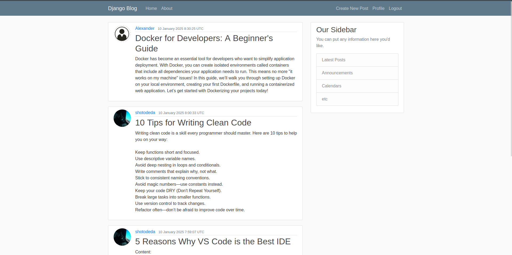
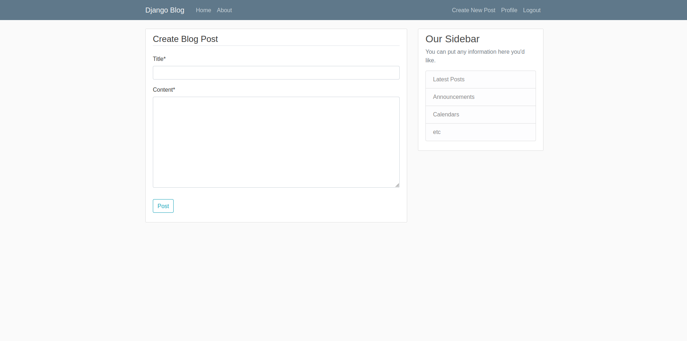
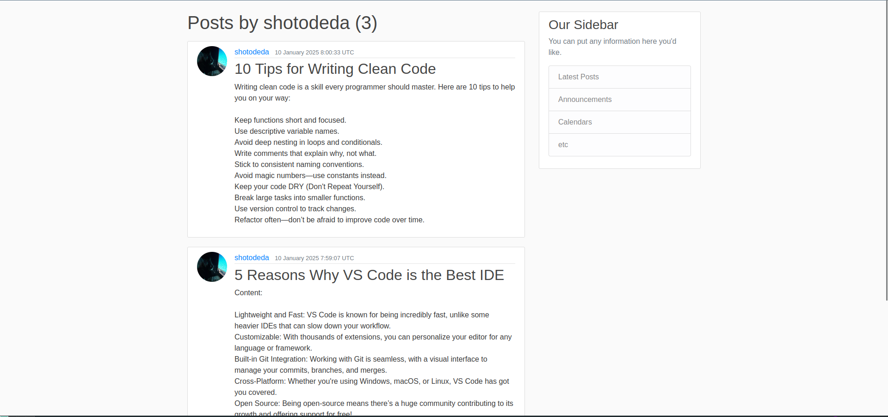
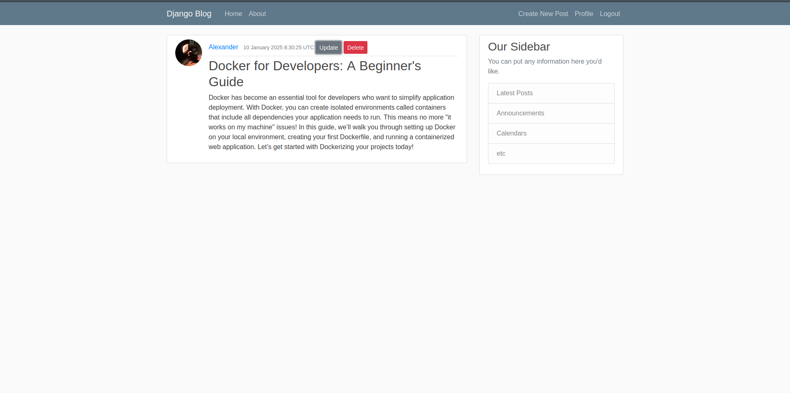
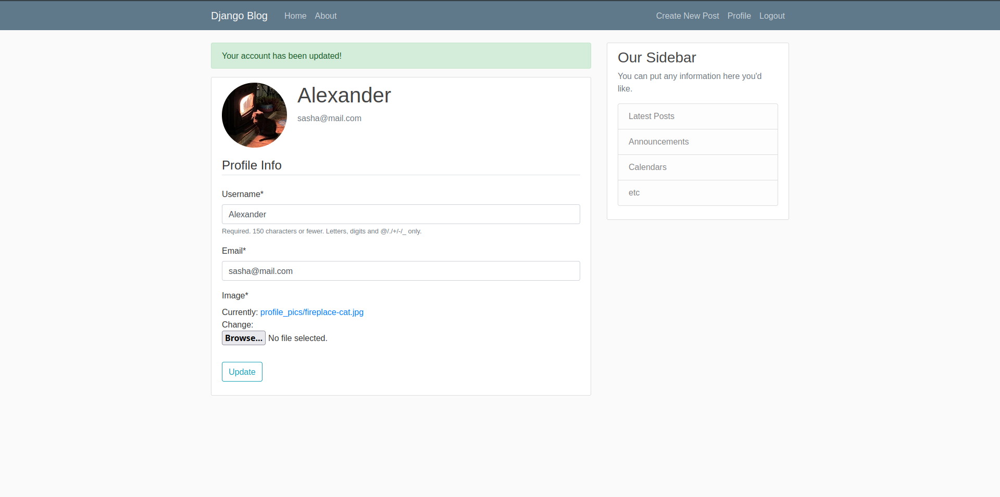

# Django Blog App

A simple and featurful blog application built with Django.

1. [Installation](#Installation)

2. [Screenshots](#Screenshots)

# Installation

1. Clone repo and move to the directory of the project
```bash
$ git clone https://github.com/shotowon/Django-Blog-App.git
$ cd Django-Blog-App
```

2. Setup and activate virtual environment
```bash
$ python -m venv .venv
$ . .venv/bin/activate # or Scripts 'instead' of 'bin' on windows
```

3. Install dependencies
```bash
$ python -m pip install -r requirements.txt
```

4. Run migrations

```bash
$ python manage.py migrate
```

5. Start

```bash
$ python manage.py runserver
```


# Demonstration

`Home page`


`Create post form`


`Watch each user's posts`


`Edit or delete posts`


`Edit profile`

